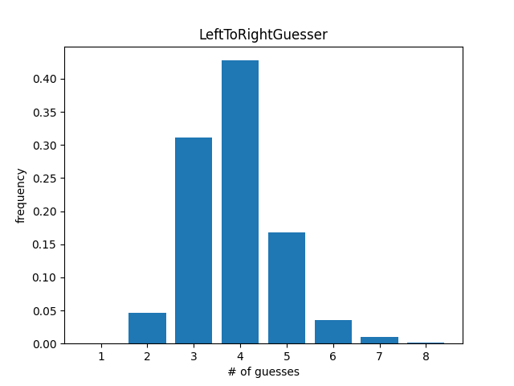
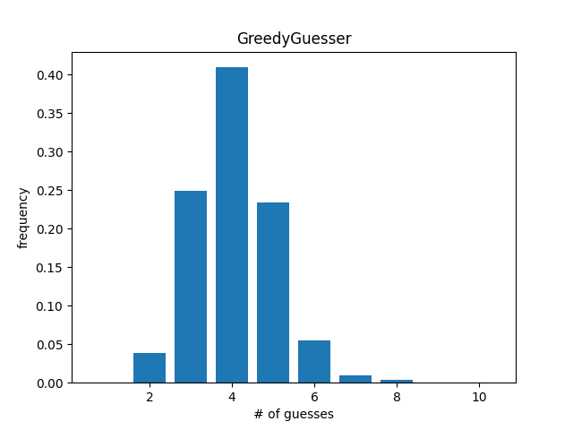
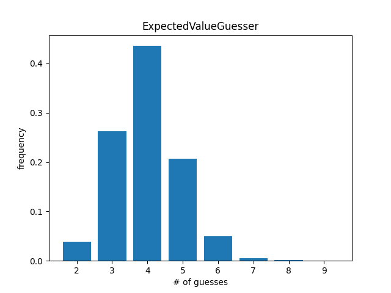

# Wordle Guesses

This project explores a few different algorithms for formulating [Wordle](https://en.wikipedia.org/wiki/Wordle) guesses.
It also offers a framework for evaluating each of these algorithms across all possible solutions.

Each guesser can take constraints, as derived from the letters and prune its list of candidates. This allows it to
derive new guesses given the feedback it receives.

## LeftToRightGuesser

### Guessing

The `LeftToRightGuesser` uses a [trie](https://en.wikipedia.org/wiki/Trie) to store all possible words, with each node
representing a letter and all root-to-leaf paths representing a word of length 5. Additionally, each node has an `size`
attribute, which represents the number of words in the subtree.

1. Ingest all words into a trie
2. Start at the root. Move to the child with the largest `size` (ie most words starting with this letter)
3. Add the current node to the `result` array
4. Continue until a leaf is reached
5. `result` contains 5 entries, one for each letter in the guess word

### Constraining

Given constraints, the guesser walks its trie in depth-first order and checks whether each node violates any existing
constraints. If so, it "tombstones" the node and moves on to the next node. This allows it to not explore paths that
have no viable candidates

### Results

First Guess: `STAID`

Average Guesses: 3.8648

Max Guesses: 8

Win Percentage: 98.9633%

## Greedy Guesser

### Guessing

The `GreedyGuesser` builds a guess word out of the most popular letter-position combinations

1. For each character in each word, increment the corresponding letter-position count
2. Sort all the letter-position combinations in descending popularity
3. Iterate through all letter-positions in order
4. If the current combination has a word in common with all the existing `selections`, add it to `selections`
5. Continue until 5 nodes are selected

### Constraining

The guesser iterates through all possible words and tombstones those that violate any constraints. The letter-position
counts are rebuilt from this new list

### Results

First Guess: `SPREE`

Average Guesses: 4.0678

Max Guesses: 10

Win Percentage: 98.5313%

## Expected Value Guesser

### Guessing

The `ExpectedValueGuesser` considers which word will have the highest value, given assigned values
for *GREEN* and *
YELLOW* guesses.

1. Create a mapping of letter-position combinations to a count of number of words containing the combination
2. Create a mapping of letters to a count of number of words containing at least on instance of this letter
3. For each word, use the mappings to find how many `Green`s and `Yellow`s it would have and compute its expected value.
   Keep track of the highest value

The expected value of a word is found by summing the expected value of each of its letters

### Constraining

The guesser iterates through all possible words and tombstones those that violate any constraints. The letter-position
counts and letter counts are rebuilt from this new list

`E[w] = $\sum_{i=1}^{5} Pr[w[i]==GREEN]*Value[GREEN] + Pr[w[i]==YELLOW]*Value[YELLOW]$`

### Results

First Guess: `SLATE`

Average Guesses: 3.9922

Max Guesses: 9

Win Percentage: 99.2225%
